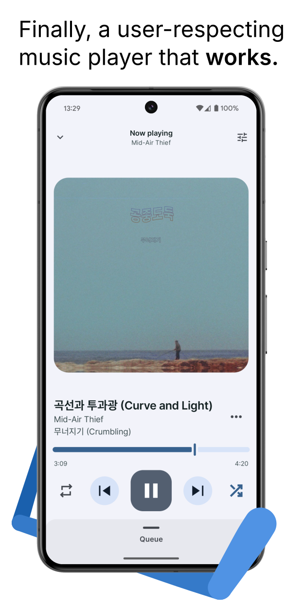
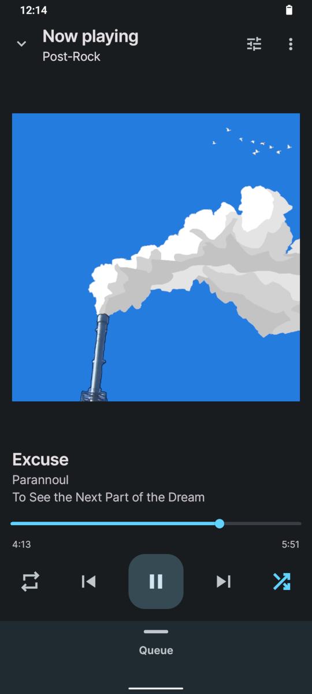
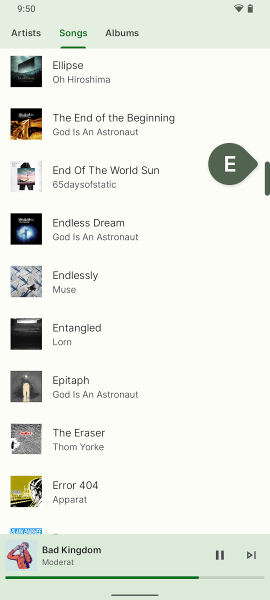
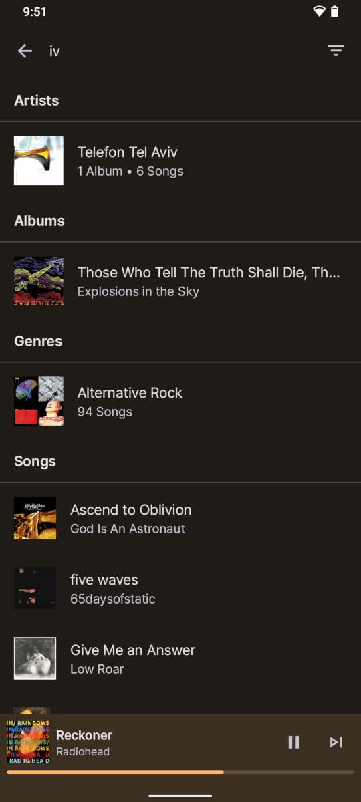
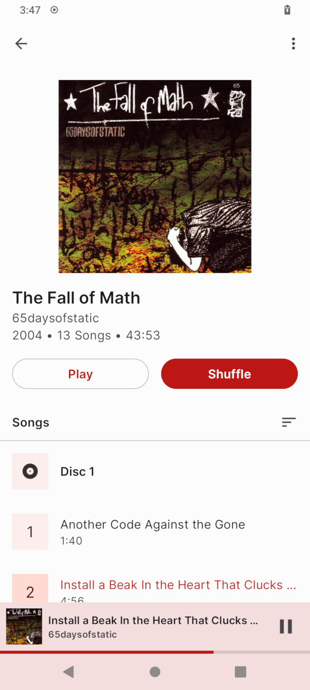
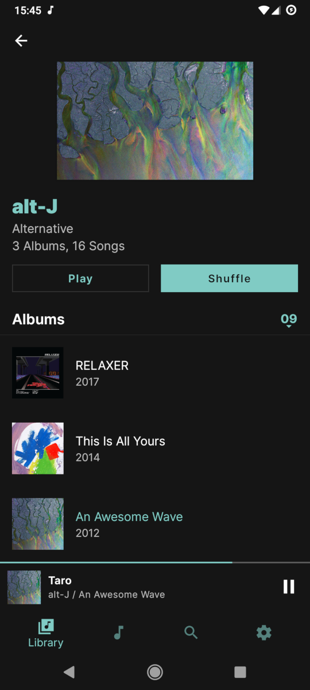
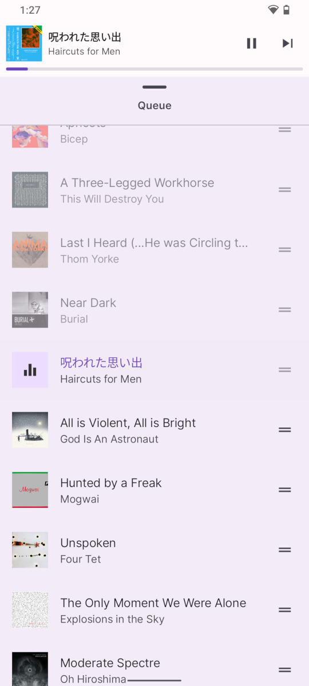
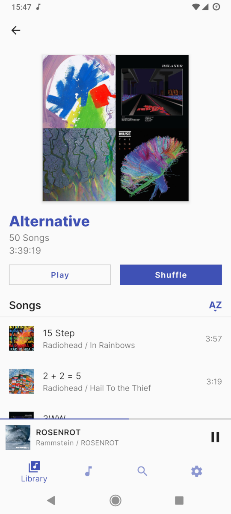

<h1 align="center"><b>Auxio</b></h1>
<h4 align="center">A simple, rational music player for android.</h4>

    
    
    
    

<h4 align="center"><a href="/CHANGELOG.md">Changelog</a> | <a href="https://github.com/OxygenCobalt/Auxio/wiki">Wiki</a></h4>

    
    

## About

Auxio is a local music player with a fast, reliable UI/UX without the many useless features present in other music players. Built off of <a href="https://exoplayer.dev/">Exoplayer</a>, Auxio has superior library support and listening quality compared to other apps that use outdated android functionality. In short, **It plays music.**

I primarily built Auxio for myself, but you can use it too, I guess.

**The default branch is the development version of the repository. For a stable version, see the master branch.**

## Screenshots

    
    
    
    
    
    
    
    

## Features

- [ExoPlayer](https://exoplayer.dev/) based playback
- Snappy UI derived from the latest Material Design guidelines
- Opinionated UX that prioritizes ease of use over edge cases
- Customizable behavior
- Support for disc numbers, multiple artists, release types,
precise/original dates, sort tags, and more
- Advanced artist system that unifies artists and album artists
- SD Card-aware folder management
- Reliable playback state persistence
- Full ReplayGain support (On MP3, FLAC, OGG, OPUS, and MP4 files)
- External equalizer support (ex. Wavelet)
- Edge-to-edge
- Embedded covers support
- Search functionality
- Headset autoplay
- Stylish widgets that automatically adapt to their size
- Completely private and offline
- No rounded album covers (Unless you want them. Then you can.)

## Permissions

- Storage (`READ_MEDIA_AUDIO`, `READ_EXTERNAL_STORAGE`) to read and play your media files
- Services (`FOREGROUND_SERVICE`, `WAKE_LOCK`) to keep the music playing even if the app itself is in background

## Building

Auxio relies on a custom version of ExoPlayer that enables some extra features. So, the build process is as follows:

1. `cd` into the project directory.
2. Run `python3 prebuild.py`, which installs ExoPlayer and it's extensions.
    - The pre-build process only works with \*nix systems. On windows, this process must be done manually.
3. Build the project normally in Android Studio.

## Contributing

Auxio accepts most contributions as long as they follow the [Contribution Guidelines](/.github/CONTRIBUTING.md).

However, feature additions and major UI changes are less likely to be accepted. See
[Why Are These Features Missing?](https://github.com/OxygenCobalt/Auxio/wiki/Why-Are-These-Features-Missing%3F)
for more information.

## License

Auxio is Free Software: You can use, study share and improve it at your
will. Specifically you can redistribute and/or modify it under the terms of the
[GNU General Public License](https://www.gnu.org/licenses/gpl.html) as
published by the Free Software Foundation, either version 3 of the License, or
(at your option) any later version.

More information can be found [here](https://github.com/OxygenCobalt/Auxio/wiki/Licenses).
