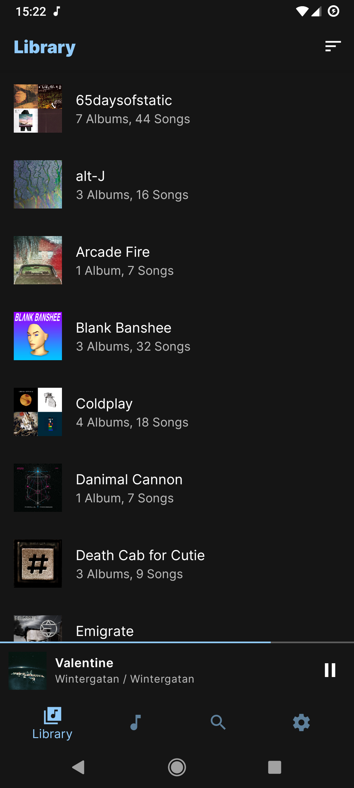
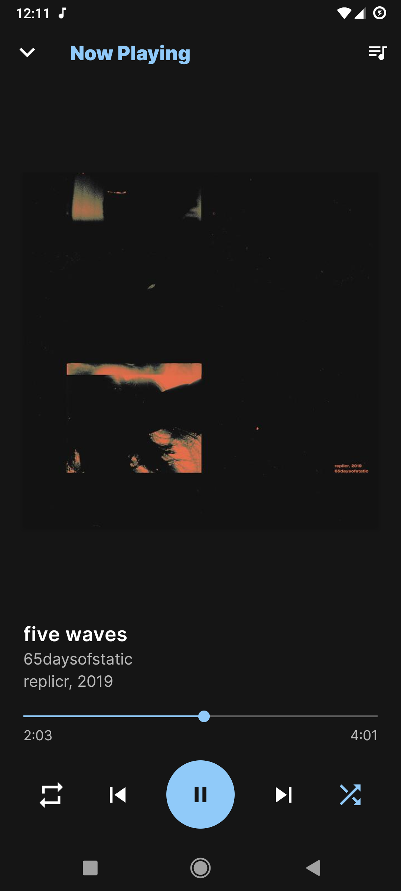
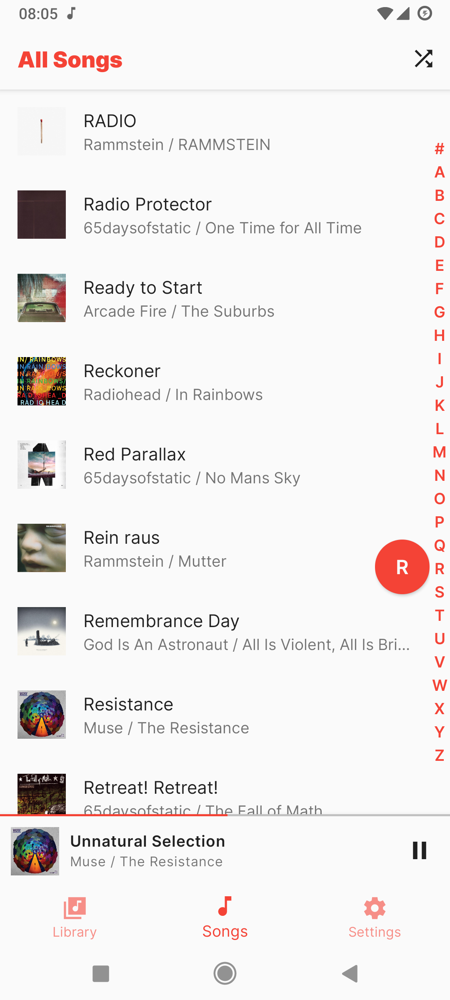
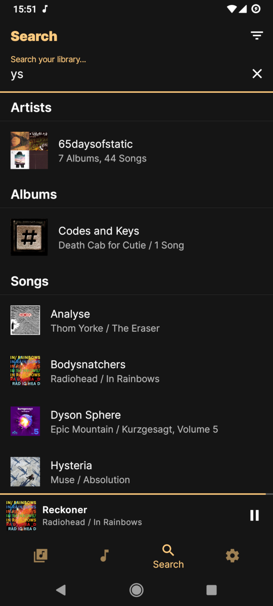
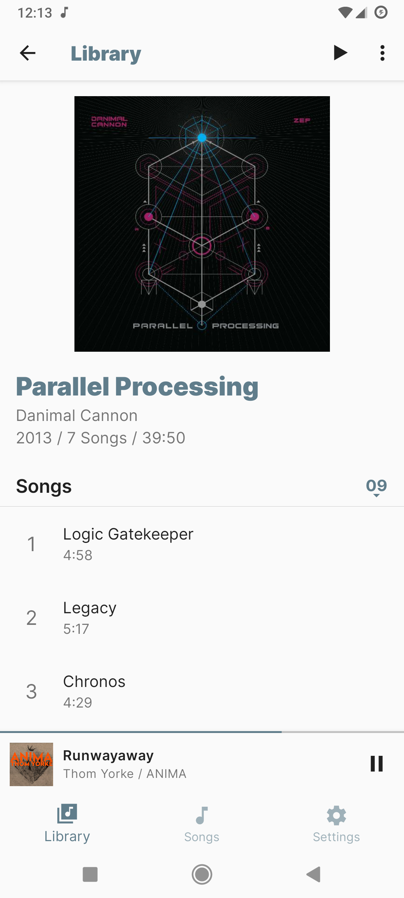
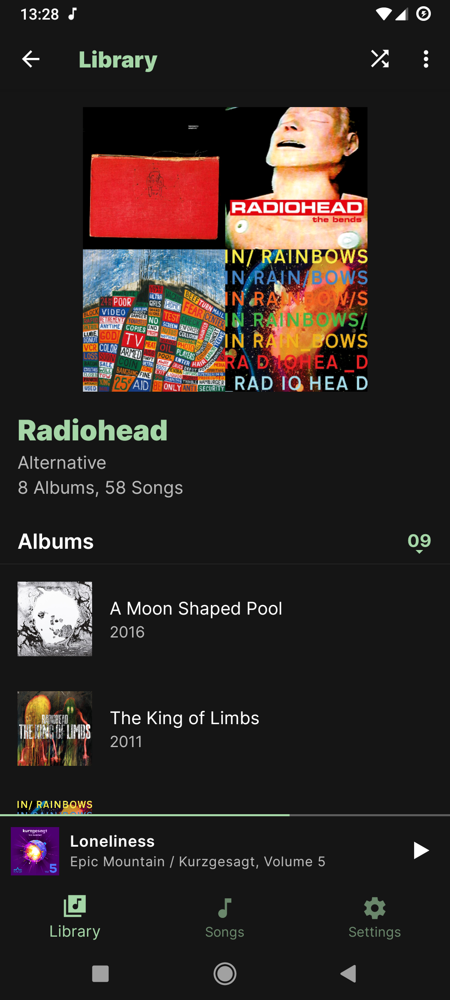
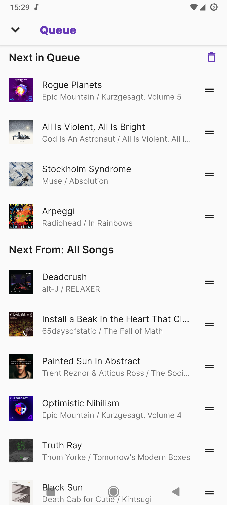
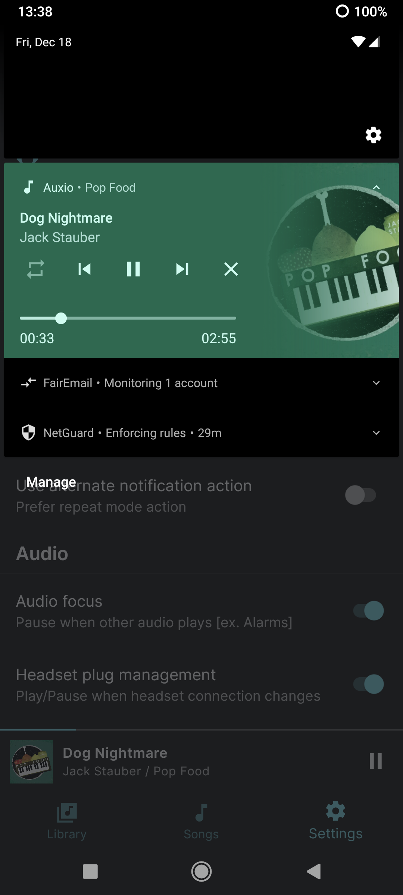
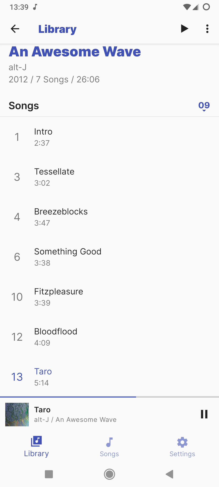

<h1 align="center"><b>Auxio</b></h1>
<h4 align="center">A sensible and customizable music player for android.</h4>

    
    
    

<h4 align="center"><a href="/info/FAQ.md">FAQ</a> / <a href="/info/FORMATS.md">Formats</a> / <a href="/info/LICENSES.md">Licenses</a> / <a href="/.github/CONTRIBUTING.md">Contributing</a></h4>

## About

Auxio is a local music player for android that I primarily built for myself.

It only has the features that I use out of a music player and nothing more, with a Spotify-Like UI/UX combined with elements from [Phonograph](https://github.com/kabouzeid/Phonograph) and [Music Player GO](https://github.com/enricocid/Music-Player-GO).
Its meant to be consistent and reliable, while still being customizable and extendable if one wants to add their own features that I (Personally) don't need.

**Note:** Auxio is still early in development, meaning that some things may change as time passes.

## Screenshots

## Features

- Reliable, [ExoPlayer](https://exoplayer.dev/) based playback
- Customizable UI & Behavior
- Extensive Genres/Artists/Albums/Songs support
- Powerful queue system
- Full playback persistence system
- Embedded covers support
- Search Functionality
- Audio Focus / Headset Management
- No internet connectivity whatsoever
- Kotlin from the ground-up
- Modular, feature-based architecture
- No rounded corners (The way god intended)

## To Come in the future:

- Better music loading system
- Improved genre/artist/album UIs
- Dedicated search tab
- Swipe-to-next-track function
- Artist Images
- Black theme
- Custom accents
- Playlists
- Liked songs
- More notification actions
- Better edge-to-edge support
- More customization options
- Other things, presumably

## Contributing

Auxio accepts most contributions as long as they follow the [Contribution Guidelines](/.github/CONTRIBUTING.md).

Feature additions and Major UI changes are less likely to be accepted. See [Accepted Additions](/info/ADDITIONS.md) for more information.

## License

  

Auxio is Free Software: You can use, study share and improve it at your
will. Specifically you can redistribute and/or modify it under the terms of the
[GNU General Public License](https://www.gnu.org/licenses/gpl.html) as
published by the Free Software Foundation, either version 3 of the License, or
(at your option) any later version.  