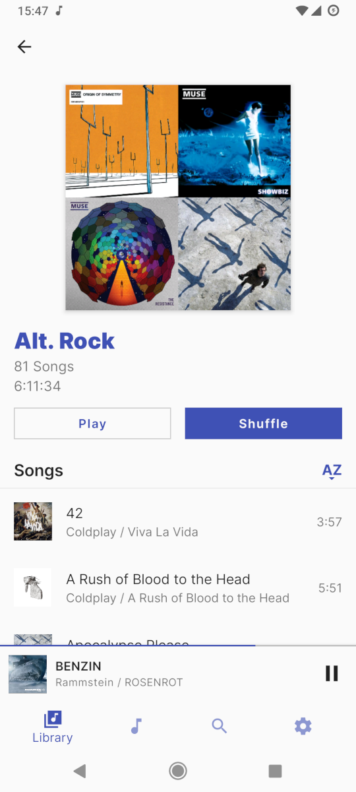
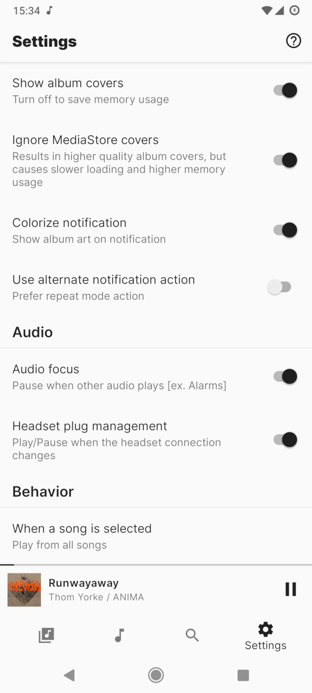

<h1 align="center"><b>Auxio</b></h1>
<h4 align="center">A sensible and customizable music player for android.</h4>

    
    
    

<h4 align="center"><a href="/info/FAQ.md">FAQ</a> / <a href="/info/FORMATS.md">Formats</a> / <a href="/info/LICENSES.md">Licenses</a> / <a href="/.github/CONTRIBUTING.md">Contributing</a></h4>

## About

Auxio is a local music player designed to be simple, straightfoward, and customizable. It has a fast, reliable UI/UX, and it is not bloated with useless features. In short, **It plays music.** Auxio is still configurable however, with both the UI and behavior able to be changed to ones liking.

Unlike other music players, Auxio is based off of [ExoPlayer](https://exoplayer.dev/), allowing for much better listening experience compared to the native MediaPlayer API. Auxio's codebase is also designed to be extendable, allowing for the addition of features that are not included in the main app.

I primarily built Auxio for myself, but you can use it too, I guess.

## Screenshots

## Features

- [ExoPlayer](https://exoplayer.dev/) based playback
- Customizable UI & Behavior
- Genres/Artists/Albums/Songs support
- Extensive queue system
- Full playback persistence system
- Edge-to-edge (Oreo+ Only)
- Embedded covers support
- Search Functionality
- Audio Focus / Headset Management
- No internet connectivity whatsoever
- Kotlin from the ground-up
- Modular, feature-based architecture
- No rounded corners

## To possibly come in the future:

- Artist Images
- Artist Songs
- Black theme
- Custom accents
- Playlists
- Liked songs
- More notification actions
- Swipe-between-tracks function (Maybe)
- Better edge-to-edge support
- More customization options
- Other things, presumably

## Contributing

Auxio accepts most contributions as long as they follow the [Contribution Guidelines](/.github/CONTRIBUTING.md).

However, feature additions and major UI changes are less likely to be accepted. See [Accepted Additions](/info/ADDITIONS.md) for more information.

## License

  

Auxio is Free Software: You can use, study share and improve it at your
will. Specifically you can redistribute and/or modify it under the terms of the
[GNU General Public License](https://www.gnu.org/licenses/gpl.html) as
published by the Free Software Foundation, either version 3 of the License, or
(at your option) any later version.