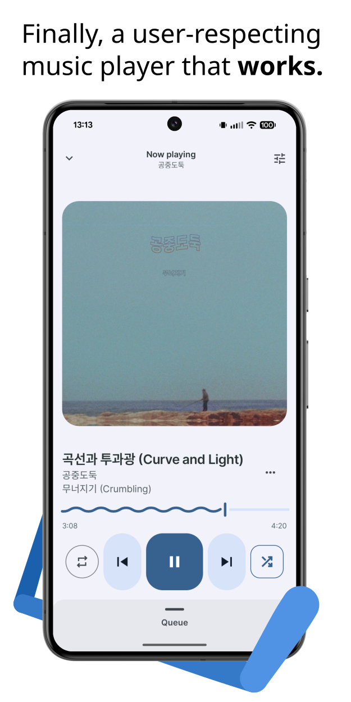
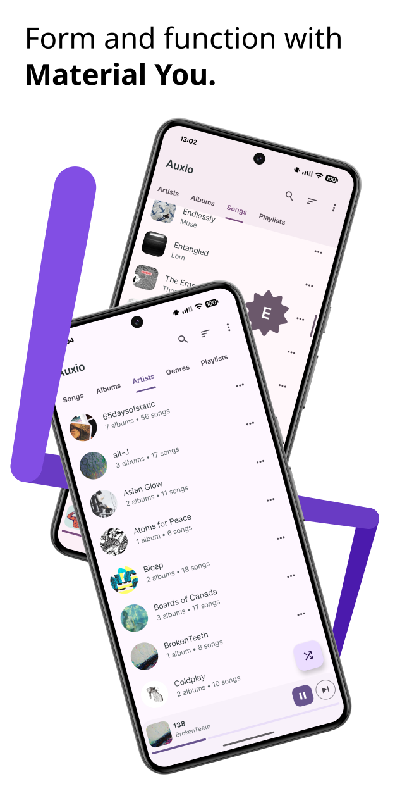
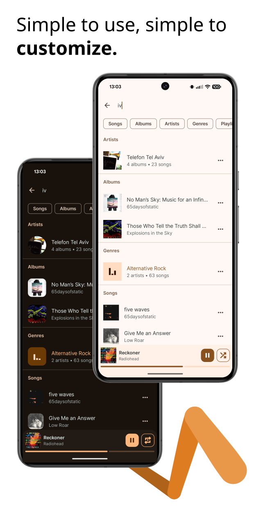
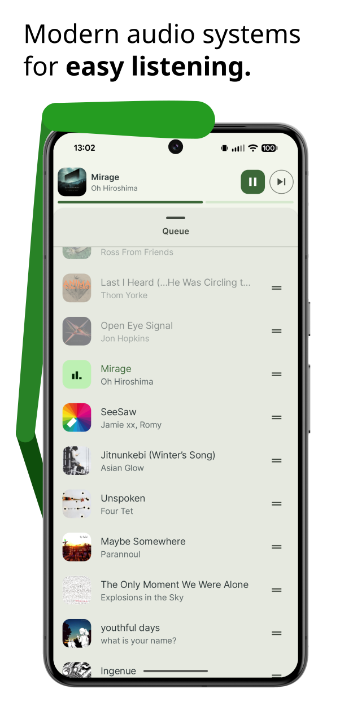
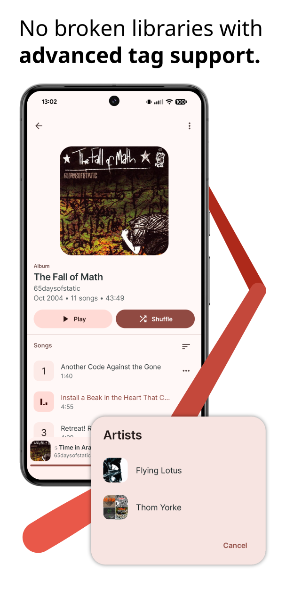
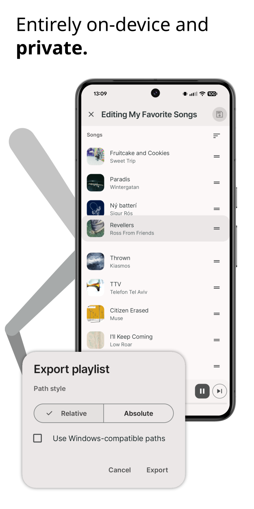

<p align="center"></p>
<h1 align="center"><b>Auxio</b></h1>
<h4 align="center">A simple, rational music player for Android.</h4>
<p align="center">
    <a href="https://github.com/oxygencobalt/Auxio/releases/tag/v4.0.10">
        
    </a>
    <a href="https://github.com/oxygencobalt/Auxio/releases/">
        
    </a>
    <a href="https://www.gnu.org/licenses/gpl-3.0">
        
    </a>
    
</p>
<h4 align="center"><a href="/CHANGELOG.md">Changelog</a> | <a href="https://github.com/OxygenCobalt/Auxio/wiki">Wiki</a> | <a href="https://github.com/OxygenCobalt/Auxio#Donate">Donate</a></h4>
<p align="center">
    <a href="https://f-droid.org/app/org.oxycblt.auxio"></a>
    <a href="https://accrescent.app/app/org.oxycblt.auxio">
        
    </a>
</p>
<p align="center">
    <a href="https://hosted.weblate.org/engage/auxio/"></a>
</p>

## About

Auxio is a local music player with a fast, reliable UI/UX without the many useless features present in other music players. Built off of modern media playback libraries, Auxio has superior library support and listening quality compared to other apps that use outdated Android functionality. In short, **It plays music.**

**The default branch is the development version of the repository. For a stable version, see the master branch.**

## Screenshots

<p align="center">
    
    
    
    
    
    
</p>


## Features

- Playback based on [Media3 ExoPlayer](https://developer.android.com/guide/topics/media/exoplayer)
- Snappy UI derived from the latest Material Design guidelines
- Opinionated UX that prioritizes ease of use over edge cases
- Customizable behavior
- Support for disc numbers, multiple artists, release types,
precise/original dates, sort tags, and more
- Advanced artist system that unifies artists and album artists
- SD Card-aware folder management
- Reliable playlisting functionality
- Playback state persistence
- Android Auto support
- Automatic gapless playback
- Full ReplayGain support (On MP3, FLAC, OGG, OPUS, and MP4 files)
- External equalizer support (ex. Wavelet)
- Edge-to-edge
- Embedded covers support
- Search functionality
- Headset autoplay
- Stylish widgets that automatically adapt to their size
- Completely private and offline
- No rounded album covers (if you want them)

## Permissions

- Storage (`READ_MEDIA_AUDIO`, `READ_EXTERNAL_STORAGE`) to read and play your music files
- Services (`FOREGROUND_SERVICE`, `WAKE_LOCK`) to keep the music playing in the background
- Notifications (`POST_NOTIFICATION`) to indicate ongoing playback and music loading

## Donate

You can support Auxio's development through [my Github Sponsors page](https://github.com/sponsors/OxygenCobalt). Get the ability to prioritize features and have your profile added to the README, Release Changelogs, and even the app itself!

<h3 align="center">Legendary supporters:</h3>
<p align="center">
    <a href="https://github.com/bkkellyh"></a> 
</p>
<h3 align="center"><a href="https://github.com/bkkellyh">@bkkellyh</a> - <i>$500!</i></h3>

<hr />

<p align="center"><b>$8/month supporters:</b></p>

<p align="center">
    <a href="https://github.com/uku3lig"></a>
</p>
<p align="center">
    And **1** Private Sponsor!
</p>


## Auxio-TS documentation

For TS18/TW/TWTHEME development and validation documentation, start with [`docs/README.md`](docs/README.md).

Canonical policy and source corpus live in [`docs/TS18_SOURCE_LED_INTEGRATION_STRATEGY.md`](docs/TS18_SOURCE_LED_INTEGRATION_STRATEGY.md).

## Building

Auxio relies on a patched version of Media3 that enables some extra playback features, alongside taglib for metadata
parsing. This adds some caveats to the build process:
1. `cmake` and `ninja-build` must be installed before building the project.
2. The project uses submodules, so when cloning initially, use `git clone --recurse-submodules` to properly
download the external code.
3. You are **unable** to build this project on windows, as the custom Media3 build runs shell scripts that
will only work on unix-based systems.

### Submodule requirements

This repository requires **recursive git submodules** to build. Gradle cannot configure the project at all
if `media/core_settings.gradle` is missing — this file lives in the `media` submodule.

**Fresh clone (recommended):**
```bash
git clone --recurse-submodules https://github.com/cbkii/Auxio-TS.git
```

**Existing clone — one-command setup:**
```bash
bash ./scripts/prepare-ci-environment.sh
```

This script handles everything: submodule sync/update, validation, and the `common_ktx/proguard-rules.txt`
stub workaround required for the current media submodule pin. It is the same script called by GitHub Actions.

After it exits 0, run Gradle normally:
```bash
./gradlew --no-daemon --stacktrace help
./gradlew --no-daemon --stacktrace :app:assembleDebug
```

> **Note for Codex / Copilot / agent environments:** ZIP snapshots without `.git` cannot run Gradle.
> `prepare-ci-environment.sh` will report `SNAPSHOT_LIMITATION` and exit 1.
> The nested `ffmpeg` submodule (`media/libraries/decoder_ffmpeg/src/main/jni/ffmpeg`)
> requires `git.ffmpeg.org` to be reachable; in air-gapped environments this submodule will fail to
> initialize and the script will report `SUBMODULE_BLOCKER`. GitHub Actions CI handles this correctly
> via `actions/checkout` with `submodules: recursive` and `fetch-depth: 0`.

**Required submodules:**

| Path | Purpose | Remote |
|------|---------|--------|
| `media/` | Patched Media3/ExoPlayer | `github.com/OxygenCobalt/media` |
| `media/libraries/decoder_ffmpeg/src/main/jni/ffmpeg/` | FFmpeg native decoder | `git.ffmpeg.org` (requires network) |
| `musikr/src/main/cpp/taglib/` | Taglib metadata parser | `github.com/taglib/taglib` |


### Set up Android Studio

#### Install Android Studio.

```bash
pkg -S android-studio
```

#### Configuring Android Studio:

- Be sure to have NDK tools, version 28.2.13676358. You can search it on Languages & Frameworks > Android SDK.
- Install Java-21 with your system package manager

    ```bash
    sudo pkg -S jdk21-openjdk
    ```
    Additionally: Set java version to jdk21-openjdk

- Run ./gradlew assembleDebug

#### Connecting to your Android Device

You can connect your Mobile Phone through USB to run the app. 

1. **Enable Developer Options on your phone**
   - Go to **Settings > About phone**  
   - Tap **Build number** 7 times until you see *"You are now a developer!"*

2. **Enable USB debugging**
   - Go to **Settings > Developer options**  
   - Turn on **USB debugging**

3. **Connect your phone to the computer**
   - Use a USB cable  
   - On your phone, accept the *Allow USB debugging?* prompt

4. **Verify that your device is detected**
   ```bash
   cd ~/Android/Sdk/platform-tools
   ./adb devices
   ```

Android Studio also offers virtual devices that come with this pre-configured.

#### Install the app on the Android Phone
To install the app on your physical device or emulator, run this command:

```bash
./gradlew installDebug
```

Auxio should now appear in the list of Apps

#### Load music to Auxio (Optional)

You can move files from your pc to your device / emulator to test the music using this command:

```bash
cd ~/Android/Sdk/platform-tools
./adb push ~Music/ /sdcard/Music
```

## Contributing

Auxio accepts most contributions as long as they follow the [Contribution Guidelines](/.github/CONTRIBUTING.md).

However, feature additions and major UI changes are less likely to be accepted. See
[Why Are These Features Missing?](https://github.com/OxygenCobalt/Auxio/wiki/Why-Are-These-Features-Missing%3F)
for more information.


## License

[](http://www.gnu.org/licenses/gpl-3.0.en.html)

Auxio is Free Software: You can use, study share and improve it at your
will. Specifically you can redistribute and/or modify it under the terms of the
[GNU General Public License](https://www.gnu.org/licenses/gpl.html) as
published by the Free Software Foundation, either version 3 of the License, or
(at your option) any later version.

More information can be found [here](https://github.com/OxygenCobalt/Auxio/wiki/Licenses).
