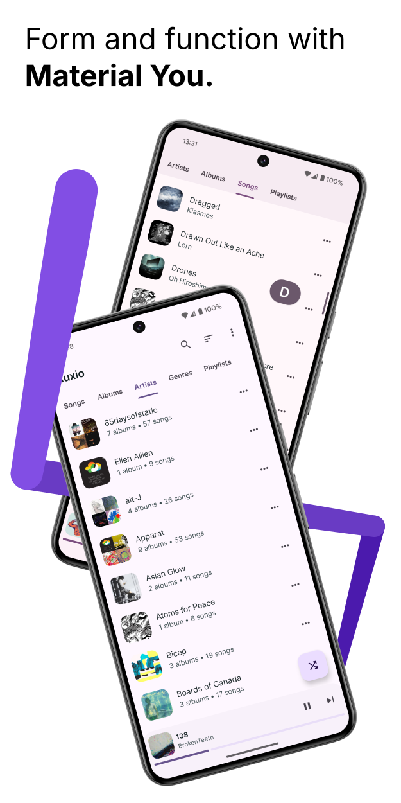
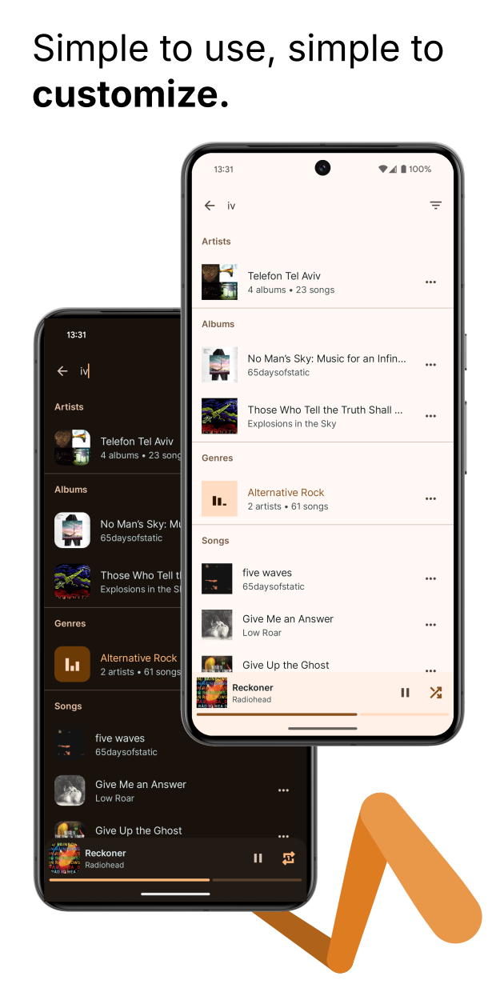
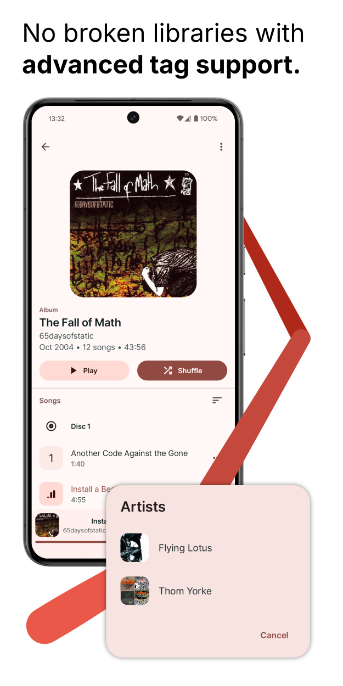
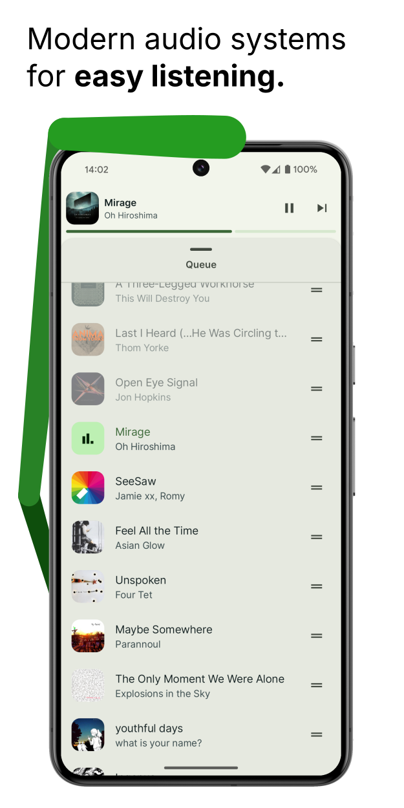
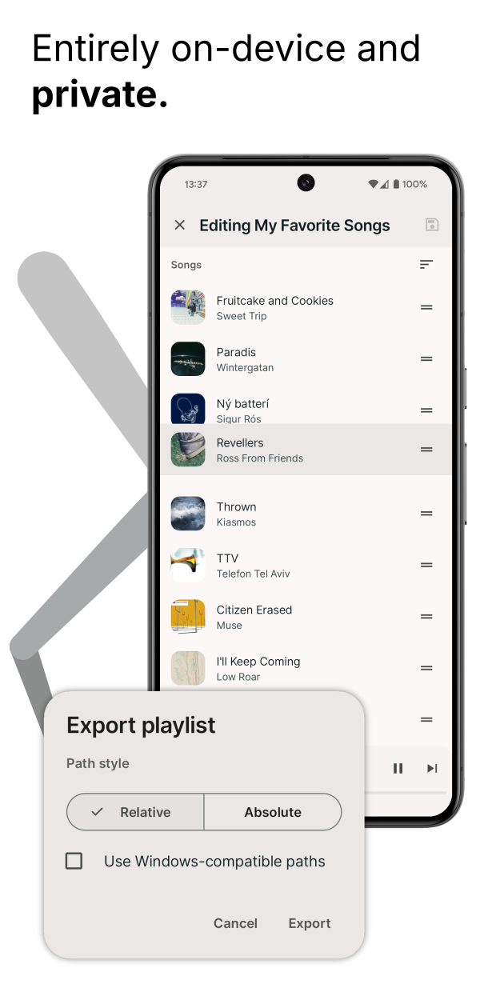

<h1 align="center"><b>Auxio</b></h1>
<h4 align="center">A simple, rational music player for android.</h4>

    
    
    
    

<h4 align="center"><a href="/CHANGELOG.md">Changelog</a> | <a href="https://github.com/OxygenCobalt/Auxio/wiki">Wiki</a> | <a href="https://github.com/OxygenCobalt/Auxio#Donate">Donate</a></h4>

    
    

## About

Auxio is a local music player with a fast, reliable UI/UX without the many useless features present in other music players. Built off of modern media playback libraries, Auxio has superior library support and listening quality compared to other apps that use outdated android functionality. In short, **It plays music.**

**The default branch is the development version of the repository. For a stable version, see the master branch.**

## Screenshots

    
    
    
    
    
    
    
    

## Features

- Playback based on [Media3 ExoPlayer](https://developer.android.com/guide/topics/media/exoplayer)
- Snappy UI derived from the latest Material Design guidelines
- Opinionated UX that prioritizes ease of use over edge cases
- Customizable behavior
- Support for disc numbers, multiple artists, release types,
precise/original dates, sort tags, and more
- Advanced artist system that unifies artists and album artists
- SD Card-aware folder management
- Reliable playlisting functionality
- Playback state persistence
- Android auto support
- Automatic gapless playback
- Full ReplayGain support (On MP3, FLAC, OGG, OPUS, and MP4 files)
- External equalizer support (ex. Wavelet)
- Edge-to-edge
- Embedded covers support
- Search functionality
- Headset autoplay
- Stylish widgets that automatically adapt to their size
- Completely private and offline
- No rounded album covers (by default)

## Permissions

- Storage (`READ_MEDIA_AUDIO`, `READ_EXTERNAL_STORAGE`) to read and play your music files
- Services (`FOREGROUND_SERVICE`, `WAKE_LOCK`) to keep the music playing in the background
- Notifcations (`POST_NOTIFICATION`) to indicate ongoing playback and music loading

## Donate

You can support Auxio's development through [my Github Sponsors page](https://github.com/sponsors/OxygenCobalt). Get the ability to prioritize features and have your profile added to the README, Release Changelogs, and even the app itself!

<b>$8/month supporters:</b>

    
    
    
    

## Building

Auxio relies on a custom version of Media3 that enables some extra features. This adds some caveats to the build process:
1. `cmake` and `ninja-build` must be installed before building the project.
2. The project uses submodules, so when cloning initially, use `git clone --recurse-submodules` to properly
download the external code.
3. You are **unable** to build this project on windows, as the custom Media3 build runs shell scripts that
will only work on unix-based systems.

## Contributing

Auxio accepts most contributions as long as they follow the [Contribution Guidelines](/.github/CONTRIBUTING.md).

However, feature additions and major UI changes are less likely to be accepted. See
[Why Are These Features Missing?](https://github.com/OxygenCobalt/Auxio/wiki/Why-Are-These-Features-Missing%3F)
for more information.

## License

Auxio is Free Software: You can use, study share and improve it at your
will. Specifically you can redistribute and/or modify it under the terms of the
[GNU General Public License](https://www.gnu.org/licenses/gpl.html) as
published by the Free Software Foundation, either version 3 of the License, or
(at your option) any later version.

More information can be found [here](https://github.com/OxygenCobalt/Auxio/wiki/Licenses).
