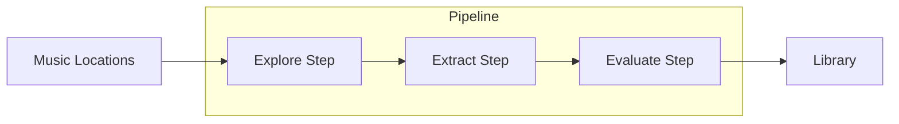
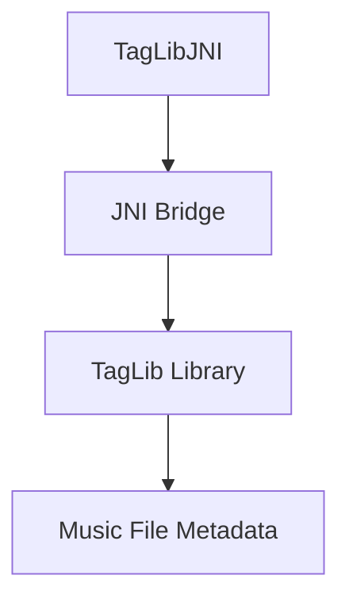
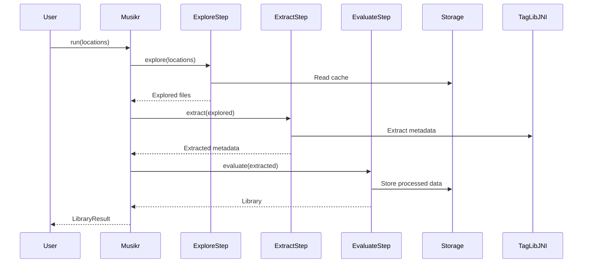

# Musikr Architecture

## Overview

Musikr is a highly opinionated multithreaded music loader that provides advanced music functionality for Auxio. It bypasses Android's MediaStore to directly access music files using the Storage Access Framework (SAF) and [TagLib](https://taglib.org/) for metadata extraction.

## Core Components

### Pipeline Architecture

Musikr uses a three-stage pipeline for music indexing:

1. **Explore Step** - Discovers music files on the device
2. **Extract Step** - Extracts metadata from discovered files
3. **Evaluate Step** - Processes extracted data to build the music library

### Key Interfaces

- **Musikr** - Main entry point for the library
- **Storage** - Manages persistent storage needs
- **Library** - Represents the loaded music collection
- **MutableLibrary** - Modifiable version of the library

## Module Structure

### 1. File System (`fs` package)
- **Location.Opened** - Represents a location to search for music
- **DeviceFS** - Provides access to device storage
- **FileTreeCache** - Caches filesystem structure for faster indexing

### 2. Pipeline (`pipeline` package)
- **ExploreStep** - Discovers music files on the device
- **ExtractStep** - Extracts metadata from discovered files
- **EvaluateStep** - Processes extracted data to build the library
- **PipelineItem** - Data items flowing through the pipeline

### 3. Metadata (`metadata` package)
- **Metadata** - Extracted file metadata
- **MetadataExtractor** - Extracts metadata using TagLib
- **TagLibJNI** - JNI bridge to native TagLib library

### 4. Tag Processing (`tag` package)
- **TagParser** - Parses raw tag data into structured format
- **TagInterpreter** - Interprets tags based on user preferences
- **ParsedTags** - Represents parsed metadata tags

### 5. Model (`model` package)
- **LibraryImpl** - Implementation of the music library
- **SongImpl**, **AlbumImpl**, **ArtistImpl**, **GenreImpl** - Music entity implementations
- **LibraryFactory** - Creates library instances from pipeline data

### 6. Covers (`covers` package)
- **Covers** - Interface for album cover management
- **EmbeddedCovers** - Extracts covers embedded in music files
- **FSCovers** - Discovers cover art in the filesystem
- **StoredCovers** - Manages persistent storage of covers

### 7. Cache (`cache` package)
- **Cache** - Caches processed music data
- **DBCache** - Database implementation of caching

### 8. Playlist (`playlist` package)
- **PlaylistFile** - Represents a playlist file
- **ExternalPlaylistManager** - Manages external playlist files
- **PlaylistInterpreter** - Interprets playlist formats

## Native Component

Musikr includes a native component built with TagLib for fast and accurate metadata extraction:

### Native Files (`cpp` directory)
- **taglib_jni.cpp** - Main JNI implementation
- **JMetadataBuilder** - Builds metadata objects from TagLib
- **JTagMap** - Maps between Java and C++ tag structures
- **JInputStream** - Input stream adapter for TagLib

## Data Flow

## Threading Model

Musikr uses Kotlin Coroutines for concurrent processing:

- Pipeline stages use `flatMapMerge` and `distributedMap` for parallel processing
- Bounded buffer channels manage backpressure
- IO operations are dispatched to `Dispatchers.IO`

## Best Practices for Extension

1. The API is minimized and unstable - be prepared to fork and modify
2. No defaults are provided - carefully consider parameter choices
3. Musikr is stateless except for Storage - manage long-term state yourself
4. When adding functionality, follow the pipeline architecture pattern